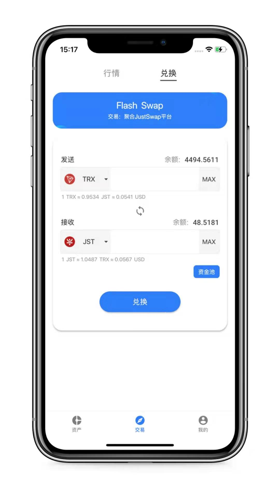

# [Flash Finance](https://flash2c.cn/)

## Flash Tron Wallet(简单、易用、安全)

- 1.数字钱包(创建钱包、导入助记词、导入私钥、备份助记词、备份私钥、代币余额查询、多地址切换管理、转账、收款)
- 2.聚合交易(聚合JustSwap、 行情价格、资金池、代币兑换)
- 3.聚合借贷(聚合JustLend、借贷) TODO

## 主要开源插件选型

- 1.状态和路由管理getx

- 2.http请求库dio

- 3.调用公链服务gRPC

- 4.屏幕适配flutter_screenutil

- 5.上拉加载下拉刷新flutter_easyrefresh

- 6.轻提示fluttertoast

- 7.数据存储shared_preferences

- 8.生成二维码qr_flutter

- 9.扫描二维码scan

- 10.版本更新ota_update

- 11.获取版本信息package_info

- 12.获取app路径path_provider

- 13.加载页面url_launcher

## lib目录分层
>common
>>config                        配置 
>>enum                          枚举 
>>util                          工具 
>>widget                        组件 

>entity                         数据模型 
>model                          数据模型 

>index                          页面相关
>>asset                         资产 
>>trade                         交易 
>>mine                          我的 

>locale                         中英文国际化 
>provider                       状态管理(调用服务、数据变更) 
>route                          路由管理 
>tron                           公链gRPC服务 

>main.dart                      执行入口 